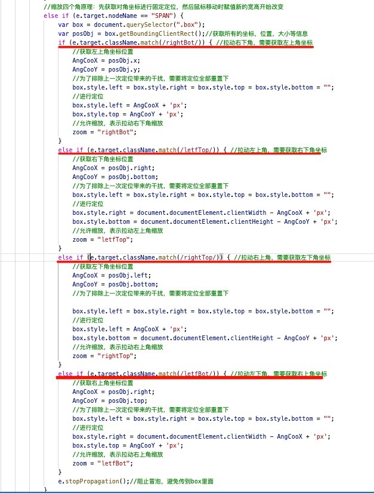

# drag-and-zoom-rectangle
原生js实现的一个可拖动和可缩放的矩形
## 思路
1. **拖动原理**：先把box进行定位，然后通过移动鼠标时同步修改定位即可

2. **缩放原理**：鼠标点在四个角上时，先获取对角坐标并进行绝对定位，然后在通过移动鼠标时同步修改box的宽高即可
---
## 注意
1. **element.getBoundingClientRect()**  方法可以直接获取当前元素的的坐标，大小，等信息

2. **每次对box进行定位后，需要重置定位属性，以免下次被影响**：box.style.left = box.style.right = box.style.top = box.style.bottom = "";

## 具体实现
1. 用div表示一个矩形,用四个span表示4个角
```html
    <div class="box">
        <span class="letfTop"></span>
        <span class="rightTop"></span>
        <span class="letfBot"></span>
        <span class="rightBot"></span>
    </div>
```
2. 并通过css定位定到上下左右四个角的位置去
```css
 <style type="text/css">
        .box {
            width: 200px;
            height: 200px;
            position: absolute;
            cursor: move;
            border: 1px solid gray;
        }

        .box>span {
            display: inline-block;
            width: 10px;
            height: 10px;
            background-color: gray;
            border: 1px solid black;
            position: absolute;
            cursor: pointer;
        }

        .box>span:nth-child(1) {
            top: -5px;
            left: -5px
        }

        .box>span:nth-child(2) {
            top: -5px;
            right: -5px
        }

        .box>span:nth-child(3) {
            bottom: -5px;
            left: -5px
        }

        .box>span:nth-child(4) {
            bottom: -5px;
            right: -5px
        }
    </style>
```
3. **开始构建js**

- 先定义一个onload函数，确保dom渲染完成后js才执行,同时在此函数中声明一些全局变量用于控制矩形的拖动和缩放
```js
 window.onload = function (e) {
    var dragging = false;// 是否拖动，默认不
    var zoom = "";// 是否缩放标识，默认不允许
    var layerX, layerY;//为鼠标初始坐标与 box 左上角坐标之距离
    var AngCooX, AngCooY;// 缩放时，对角坐标位置（box固定定位位置）
 }

```
- 定义三个事件处理函数：鼠标按下，鼠标移动，鼠标抬起(所有的操作都在这三个事件函数里面进行执行)
```js
// 鼠标按下
document.onmousedown = function (e) {}
// 鼠标移动
document.onmousemove = function (e) {}
// 鼠标抬起
document.onmouseup = function (e) {}
```
- **拖动实现**：
1. 在鼠标移动时，计算鼠标移动的位置对应的新的box左上角坐标
2. 通过定位将box定到新的位置来
```js
   //  鼠标按
 document.onmousedown = function (e) {
    e = e || window.event;
    // 为了拖动box，计算鼠标按下那刻的layer坐标
    if (e.target.className.match(/box/)) {
        // 允许拖动
        dragging = true;
        // 计算坐标差值(距离页面左上角-box左上角的坐标值)
        layerX = e.layerX;
        layerY = e.layerY;
    }
 }
  //  鼠标移动
  document.onmousemove = function (e) {
      e = e || window.event;
      // 移动，更新 box 坐标（新坐标减去diff就是实移动的距离）
      var box = document.querySelector(".box");
      if (e.target.className.match(/box/) && dragging) {
          box.style.top = e.pageY - layerX +'px';
          box.style.left = e.pageX - layerY +'px';
      }

// 鼠标抬起
   document.onmouseup = function (e) {
       //禁止拖动
       dragging = false;
       //禁止缩放
       zoom = "";
   };
```
- **缩放实现**：
1. 鼠标点在四个角上时，先获取对角坐标并进行绝对定位，
2. 然后在通过移动鼠标时同步修改box的宽高即可
---
 **代码较多，这里为了看完整代码就直接上图**
```js
  //  鼠标按下
 document.onmousedown = function (e) {
    e = e || window.event;
    // 为了拖动box，计算鼠标按下那刻的layer坐标
    if (e.target.className.match(/box/)) {
        // 允许拖动
        dragging = true;
        // 计算坐标差值(距离页面左上角-box左上角的坐标值)
        layerX = e.layerX;
        layerY = e.layerY;
    }
```
**缩放四个角原理：先获取对角坐标进行固定定位，然后鼠标移动时赋值新的宽高开始改变**

```js
 }

  //  鼠标移动
  document.onmousemove = function (e) {
      e = e || window.event;
      // 移动，更新 box 坐标（新坐标减去diff就是实移动的距离）
      var box = document.querySelector(".box");
      if (e.target.className.match(/box/) && dragging) {
          box.style.top = e.pageY - layerX +'px';
          box.style.left = e.pageX - layerY +'px';
      }
//缩放代码      
      else if (zoom === "rightBot") {  //拉动的是右下角
        box.style.width = e.pageX - AngCooX + 'px';
        box.style.height = e.pageY - AngCooY + 'px';
      }
      else if (zoom === "letfTop") {  //拉动的是左上角
          box.style.width = Math.abs(e.pageX - AngCooX) + 'px';
          box.style.height = Math.abs(e.pageY - AngCooY) + 'px';
      }
      else if (zoom === "rightTop") {  //拉动的是右上角
          box.style.width = Math.abs(e.pageX - AngCooX) + 'px';
          box.style.height = Math.abs(e.pageY - AngCooY) + 'px';
      }
      else if (zoom === "letfBot") {  //拉动的是右上角
          box.style.width = Math.abs(e.pageX - AngCooX) + 'px';
          box.style.height = Math.abs(e.pageY - AngCooY) + 'px';
      }
```

```js
  }
// 鼠标抬起
   document.onmouseup = function (e) {
       //禁止拖动
       dragging = false;
       //禁止缩放
       zoom = "";
   };
```
 
## 在提醒一遍注意点
1. **element.getBoundingClientRect()**  方法可以直接获取当前元素的的坐标，大小，等信息

2. **每次对box进行定位后，需要重置定位属性，以免下次被影响**：box.style.left = box.style.right = box.style.top = box.style.bottom = "";
